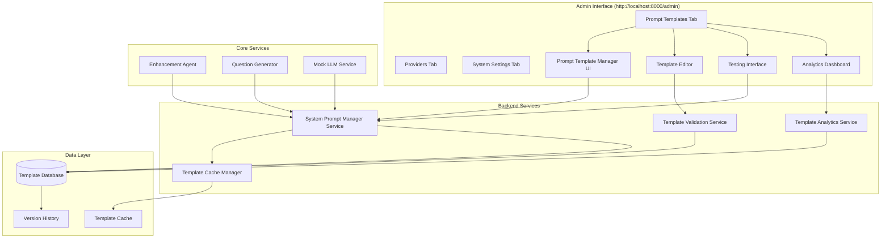
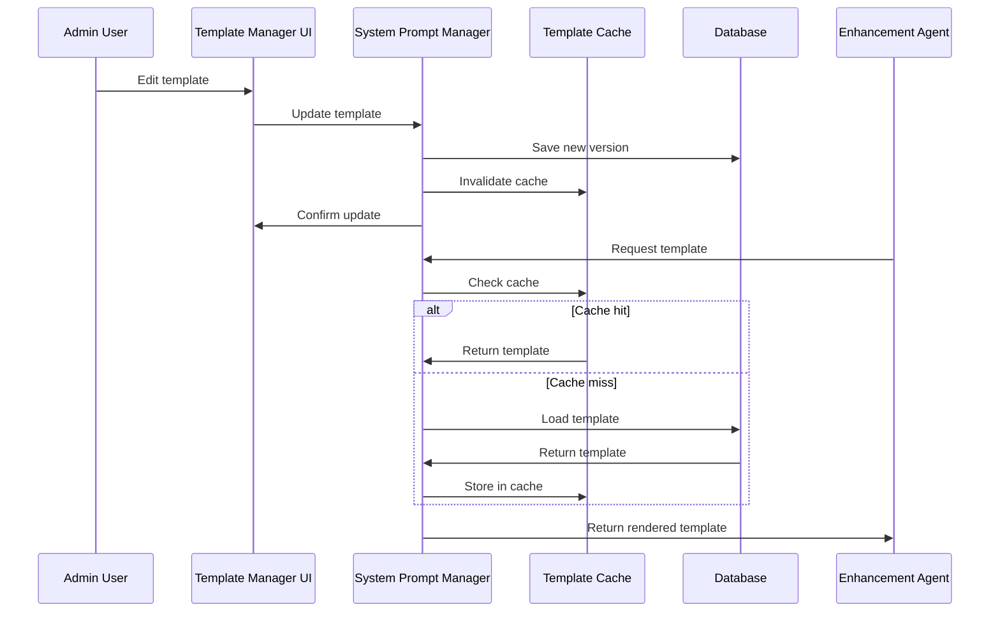

# Design Document

## Overview

The Customizable LLM Prompts feature transforms hardcoded prompt strings into a flexible, database-driven system that allows administrators to manage all LLM interactions through the existing Admin interface at `http://localhost:8000/admin`. This will be implemented as a new "Prompt Templates" tab alongside the existing "Providers" tab, maintaining consistency with the current admin interface design. The system maintains backward compatibility while adding powerful customization capabilities for prompt optimization across different domains and LLM providers.

## Architecture

### High-Level Architecture



### Component Interaction Flow



## Admin Interface Integration

### Navigation Structure

The Prompt Templates feature will be integrated into the existing admin interface with the following navigation structure:

```
Admin Interface (http://localhost:8000/admin)
├── Providers (existing)
├── Prompt Templates (new)
│   ├── Enhancement Templates
│   ├── Question Generation Templates  
│   ├── System Prompts
│   ├── Mock Templates (dev/test only)
│   └── Analytics & Performance
└── System Settings (existing)
```

### UI Components Integration

The new Prompt Templates tab will follow the same design patterns as the existing Providers tab:

- **List View**: Table showing all templates with categories, names, last modified, and status
- **Detail View**: Full template editor with syntax highlighting and variable management
- **Test Interface**: Built-in testing panel similar to provider connection testing
- **Analytics Dashboard**: Performance metrics and usage statistics

### Consistent Admin Experience

- Same authentication and authorization as existing admin features
- Consistent Material-UI components and styling
- Same responsive design patterns for mobile/desktop
- Integrated with existing admin navigation and breadcrumbs

## Components and Interfaces

### 1. System Prompt Manager Service

**Purpose**: Central service for managing all LLM prompt templates

**Key Interfaces**:

```typescript
interface SystemPromptManager {
  // Template Management
  getTemplate(category: TemplateCategory, key: string, context?: TemplateContext): Promise<string>;
  updateTemplate(category: TemplateCategory, key: string, content: string, metadata: TemplateMetadata): Promise<void>;
  listTemplates(category?: TemplateCategory, filters?: TemplateFilters): Promise<TemplateInfo[]>;
  
  // Template Validation
  validateTemplate(content: string, variables: TemplateVariable[]): ValidationResult;
  testTemplate(templateId: string, testData: TemplateTestData): Promise<TemplateTestResult>;
  
  // Version Management
  getTemplateHistory(templateId: string): Promise<TemplateVersion[]>;
  revertTemplate(templateId: string, version: number): Promise<void>;
  
  // Analytics
  getTemplateUsageStats(templateId: string, timeRange: TimeRange): Promise<UsageStats>;
  getTemplatePerformanceMetrics(templateId: string): Promise<PerformanceMetrics>;
}

interface TemplateInfo {
  id: string;
  category: TemplateCategory;
  key: string;
  name: string;
  description: string;
  variables: TemplateVariable[];
  lastModified: Date;
  version: number;
  usageCount: number;
  isActive: boolean;
}

enum TemplateCategory {
  ENHANCEMENT = 'enhancement',
  QUESTION_GENERATION = 'question_generation',
  MOCK_RESPONSES = 'mock_responses',
  SYSTEM_PROMPTS = 'system_prompts',
  CUSTOM = 'custom'
}

interface TemplateVariable {
  name: string;
  type: 'string' | 'number' | 'boolean' | 'array' | 'object';
  description: string;
  required: boolean;
  defaultValue?: any;
  validation?: ValidationRule[];
}

interface TemplateContext {
  provider?: string;
  taskType?: string;
  domainKnowledge?: string;
  userContext?: Record<string, any>;
}
```

### 2. Template Cache Manager

**Purpose**: High-performance caching layer for frequently accessed templates

**Key Features**:
- In-memory LRU cache with configurable size limits
- Automatic cache invalidation on template updates
- Cache warming for critical templates
- Performance monitoring and metrics

```typescript
interface TemplateCacheManager {
  get(key: string): Promise<string | null>;
  set(key: string, value: string, ttl?: number): Promise<void>;
  invalidate(key: string): Promise<void>;
  invalidateCategory(category: TemplateCategory): Promise<void>;
  warmCache(templateIds: string[]): Promise<void>;
  getCacheStats(): CacheStats;
}
```

### 3. Template Validation Service

**Purpose**: Comprehensive validation for template syntax and semantics

**Validation Rules**:
- Variable syntax validation ({{variable_name}} format)
- Required variable presence checking
- Circular reference detection
- Provider-specific format validation
- Security validation (no code injection)

```typescript
interface TemplateValidationService {
  validateSyntax(template: string): SyntaxValidationResult;
  validateVariables(template: string, variables: TemplateVariable[]): VariableValidationResult;
  validateSecurity(template: string): SecurityValidationResult;
  validateProviderCompatibility(template: string, provider: string): CompatibilityValidationResult;
}
```

### 4. Template Analytics Service

**Purpose**: Performance monitoring and usage analytics for templates

```typescript
interface TemplateAnalyticsService {
  recordUsage(templateId: string, context: UsageContext): Promise<void>;
  recordPerformance(templateId: string, metrics: PerformanceData): Promise<void>;
  getUsageReport(templateId: string, timeRange: TimeRange): Promise<UsageReport>;
  getPerformanceReport(templateId: string, timeRange: TimeRange): Promise<PerformanceReport>;
  getTopPerformingTemplates(category: TemplateCategory, limit: number): Promise<TemplateRanking[]>;
}
```

## Data Models

### Template Storage Schema

```sql
-- Main templates table
CREATE TABLE prompt_templates (
    id UUID PRIMARY KEY DEFAULT gen_random_uuid(),
    category VARCHAR(50) NOT NULL,
    key VARCHAR(100) NOT NULL,
    name VARCHAR(200) NOT NULL,
    description TEXT,
    content TEXT NOT NULL,
    variables JSONB DEFAULT '[]',
    metadata JSONB DEFAULT '{}',
    is_active BOOLEAN DEFAULT true,
    is_default BOOLEAN DEFAULT false,
    created_at TIMESTAMP DEFAULT NOW(),
    updated_at TIMESTAMP DEFAULT NOW(),
    created_by UUID REFERENCES users(id),
    updated_by UUID REFERENCES users(id),
    
    UNIQUE(category, key)
);

-- Template versions for history tracking
CREATE TABLE prompt_template_versions (
    id UUID PRIMARY KEY DEFAULT gen_random_uuid(),
    template_id UUID REFERENCES prompt_templates(id) ON DELETE CASCADE,
    version_number INTEGER NOT NULL,
    content TEXT NOT NULL,
    variables JSONB DEFAULT '[]',
    metadata JSONB DEFAULT '{}',
    change_message TEXT,
    created_at TIMESTAMP DEFAULT NOW(),
    created_by UUID REFERENCES users(id),
    
    UNIQUE(template_id, version_number)
);

-- Template usage analytics
CREATE TABLE prompt_template_usage (
    id UUID PRIMARY KEY DEFAULT gen_random_uuid(),
    template_id UUID REFERENCES prompt_templates(id) ON DELETE CASCADE,
    usage_context JSONB DEFAULT '{}',
    execution_time_ms INTEGER,
    success BOOLEAN,
    error_message TEXT,
    created_at TIMESTAMP DEFAULT NOW()
);

-- Template performance metrics
CREATE TABLE prompt_template_metrics (
    id UUID PRIMARY KEY DEFAULT gen_random_uuid(),
    template_id UUID REFERENCES prompt_templates(id) ON DELETE CASCADE,
    metric_type VARCHAR(50) NOT NULL,
    metric_value DECIMAL(10,4),
    measurement_date DATE DEFAULT CURRENT_DATE,
    
    UNIQUE(template_id, metric_type, measurement_date)
);
```

### Default Template Definitions

```typescript
interface DefaultTemplate {
  category: TemplateCategory;
  key: string;
  name: string;
  description: string;
  content: string;
  variables: TemplateVariable[];
  metadata: {
    provider_optimized?: string[];
    task_types?: string[];
    complexity_level?: 'basic' | 'intermediate' | 'advanced';
  };
}

// Example default templates
const DEFAULT_TEMPLATES: DefaultTemplate[] = [
  {
    category: TemplateCategory.ENHANCEMENT,
    key: 'main_enhancement_prompt',
    name: 'Main Enhancement Instruction',
    description: 'Primary template for converting human prompts to structured format',
    content: `Please enhance the following human-readable prompt into a structured format.

HUMAN PROMPT:
Goal: {{goal}}
Audience: {{audience}}
Steps: {{steps}}
Output Format: {{output_format}}
Expected Fields: {{expected_fields}}

REQUIREMENTS:
- Convert to structured format with system instructions, user template, rules, and capabilities
- Extract variables using {{variable_name}} syntax where content should be dynamic
- Preserve the original intent and goal
- Make the prompt clear, specific, and actionable
- Include appropriate rules and constraints
{{#if target_provider}}- Optimize for {{target_provider}} provider{{/if}}
{{#if domain_knowledge}}- Consider this domain context: {{domain_knowledge}}{{/if}}

Respond with a JSON object containing the structured prompt format.`,
    variables: [
      { name: 'goal', type: 'string', description: 'The main goal of the prompt', required: true },
      { name: 'audience', type: 'string', description: 'Target audience', required: true },
      { name: 'steps', type: 'array', description: 'List of steps', required: true },
      { name: 'output_format', type: 'string', description: 'Expected output format', required: true },
      { name: 'expected_fields', type: 'string', description: 'Expected output fields', required: true },
      { name: 'target_provider', type: 'string', description: 'Target LLM provider', required: false },
      { name: 'domain_knowledge', type: 'string', description: 'Domain-specific context', required: false }
    ],
    metadata: {
      provider_optimized: ['openai', 'anthropic', 'meta'],
      complexity_level: 'intermediate'
    }
  },
  {
    category: TemplateCategory.ENHANCEMENT,
    key: 'system_enhancement_prompt',
    name: 'Enhancement System Instructions',
    description: 'System-level instructions for the enhancement agent',
    content: `You are an expert prompt engineer specializing in converting human-readable prompts into structured, reusable formats. Your goal is to:

1. Preserve the original intent and meaning
2. Create clear, actionable system instructions
3. Design flexible user templates with appropriate variables
4. Define specific rules and constraints
5. Identify required capabilities
6. Ensure the result is provider-agnostic and reusable

Focus on clarity, specificity, and maintainability. Extract variables for any content that should be dynamic or reusable.`,
    variables: [],
    metadata: {
      complexity_level: 'basic'
    }
  }
];
```

## Error Handling

### Template Loading Errors

```typescript
class TemplateError extends Error {
  constructor(
    message: string,
    public templateId: string,
    public category: TemplateCategory,
    public errorType: 'NOT_FOUND' | 'VALIDATION_ERROR' | 'RENDERING_ERROR' | 'CACHE_ERROR'
  ) {
    super(message);
    this.name = 'TemplateError';
  }
}

// Error handling strategy
async function getTemplateWithFallback(
  category: TemplateCategory, 
  key: string, 
  context?: TemplateContext
): Promise<string> {
  try {
    // Try to get custom template
    return await systemPromptManager.getTemplate(category, key, context);
  } catch (error) {
    if (error instanceof TemplateError && error.errorType === 'NOT_FOUND') {
      // Fall back to default template
      logger.warn(`Custom template not found, using default: ${category}/${key}`);
      return await getDefaultTemplate(category, key, context);
    }
    throw error;
  }
}
```

### Validation Error Handling

```typescript
interface ValidationResult {
  isValid: boolean;
  errors: ValidationError[];
  warnings: ValidationWarning[];
}

interface ValidationError {
  type: 'SYNTAX_ERROR' | 'MISSING_VARIABLE' | 'INVALID_VARIABLE' | 'SECURITY_VIOLATION';
  message: string;
  line?: number;
  column?: number;
  suggestion?: string;
}
```

## Testing Strategy

### Unit Testing

```typescript
describe('SystemPromptManager', () => {
  describe('getTemplate', () => {
    it('should return cached template when available', async () => {
      // Test cache hit scenario
    });
    
    it('should load from database when cache miss', async () => {
      // Test cache miss scenario
    });
    
    it('should fall back to default template when custom not found', async () => {
      // Test fallback mechanism
    });
    
    it('should render variables correctly', async () => {
      // Test variable substitution
    });
  });
  
  describe('updateTemplate', () => {
    it('should validate template before saving', async () => {
      // Test validation integration
    });
    
    it('should create version history entry', async () => {
      // Test versioning
    });
    
    it('should invalidate cache after update', async () => {
      // Test cache invalidation
    });
  });
});
```

### Integration Testing

```typescript
describe('Template Integration', () => {
  it('should work with Enhancement Agent', async () => {
    // Test that Enhancement Agent can use custom templates
    const customTemplate = await createTestTemplate();
    const result = await enhancementAgent.enhance(testPrompt);
    expect(result).toBeDefined();
  });
  
  it('should work with Question Generator', async () => {
    // Test that Question Generator uses custom templates
    const questions = await questionGenerator.generateQuestions(testContext);
    expect(questions).toHaveLength(2);
  });
});
```

### Performance Testing

```typescript
describe('Template Performance', () => {
  it('should load templates within 10ms from cache', async () => {
    const start = Date.now();
    await systemPromptManager.getTemplate('enhancement', 'main_prompt');
    const duration = Date.now() - start;
    expect(duration).toBeLessThan(10);
  });
  
  it('should handle concurrent template requests', async () => {
    const promises = Array(100).fill(0).map(() => 
      systemPromptManager.getTemplate('enhancement', 'main_prompt')
    );
    const results = await Promise.all(promises);
    expect(results).toHaveLength(100);
  });
});
```

## Security Considerations

### Template Content Security

1. **Input Sanitization**: All template content is sanitized to prevent code injection
2. **Variable Validation**: Template variables are validated against allowed patterns
3. **Access Control**: Role-based permissions for template management
4. **Audit Logging**: All template changes are logged with user attribution

### Template Isolation

```typescript
class TemplateSecurityValidator {
  validateContent(content: string): SecurityValidationResult {
    const violations: SecurityViolation[] = [];
    
    // Check for code injection patterns
    if (this.containsCodeInjection(content)) {
      violations.push({
        type: 'CODE_INJECTION',
        message: 'Template contains potentially dangerous code patterns'
      });
    }
    
    // Check for sensitive data exposure
    if (this.containsSensitivePatterns(content)) {
      violations.push({
        type: 'SENSITIVE_DATA',
        message: 'Template may expose sensitive information'
      });
    }
    
    return {
      isSecure: violations.length === 0,
      violations
    };
  }
}
```

## Performance Optimization

### Caching Strategy

1. **Multi-Level Caching**:
   - L1: In-memory application cache (Redis)
   - L2: Database query result cache
   - L3: Rendered template cache

2. **Cache Warming**: Critical templates are pre-loaded into cache on startup

3. **Intelligent Invalidation**: Only affected templates are invalidated on updates

### Database Optimization

```sql
-- Indexes for performance
CREATE INDEX idx_prompt_templates_category_key ON prompt_templates(category, key);
CREATE INDEX idx_prompt_templates_active ON prompt_templates(is_active) WHERE is_active = true;
CREATE INDEX idx_template_usage_template_date ON prompt_template_usage(template_id, created_at);
CREATE INDEX idx_template_metrics_template_type ON prompt_template_metrics(template_id, metric_type);
```

## Migration Strategy

### Phase 1: Infrastructure Setup
1. Create database schema
2. Implement core services
3. Add default templates
4. Create admin UI

### Phase 2: Service Integration
1. Update Enhancement Agent to use template service
2. Update Question Generator to use template service
3. Maintain backward compatibility

### Phase 3: Advanced Features
1. Add analytics and monitoring
2. Implement A/B testing
3. Add template optimization suggestions

### Backward Compatibility

```typescript
// Compatibility layer for existing code
class EnhancementAgentCompatibility {
  private systemPromptManager: SystemPromptManager;
  
  // Legacy method - maintained for compatibility
  private buildEnhancementPrompt(humanPrompt: HumanPrompt, context?: EnhancementContext): string {
    // Delegate to new template system
    return this.systemPromptManager.getTemplate(
      TemplateCategory.ENHANCEMENT,
      'main_enhancement_prompt',
      { ...context, humanPrompt }
    );
  }
  
  // Legacy method - maintained for compatibility
  private getEnhancementSystemPrompt(): string {
    return this.systemPromptManager.getTemplate(
      TemplateCategory.ENHANCEMENT,
      'system_enhancement_prompt'
    );
  }
}
```

This design ensures a smooth transition from hardcoded prompts to a flexible, manageable system while maintaining all existing functionality and adding powerful new capabilities for prompt optimization and customization.