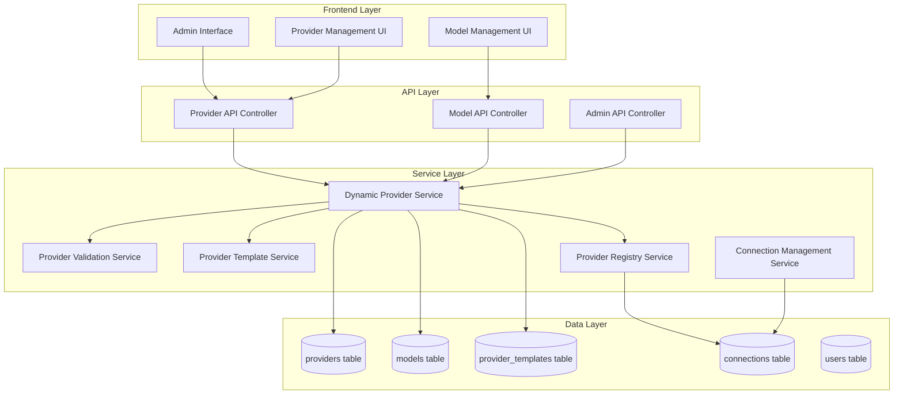

# Design Document

## Overview

The Dynamic Provider Management system will extend the existing prompt library infrastructure to support runtime configuration of LLM providers and models through an administrative interface. This design builds upon the current hardcoded provider system (OpenAI, Anthropic, Meta, AWS Bedrock, Microsoft Copilot) to create a flexible, extensible architecture that allows administrators to add new providers and models without code changes.

The system will maintain backward compatibility with existing connections while introducing new database tables and services to manage dynamic provider configurations. The design follows the existing architectural patterns and integrates seamlessly with the current provider registry, connection management, and admin interface systems.

## Architecture

### High-Level Architecture



### Database Schema Extensions

The design introduces three new tables to support dynamic provider management:

#### providers Table
```sql
CREATE TABLE providers (
    id UUID PRIMARY KEY DEFAULT gen_random_uuid(),
    identifier VARCHAR(50) UNIQUE NOT NULL,  -- e.g., 'openai', 'anthropic-custom'
    name VARCHAR(255) NOT NULL,              -- Display name
    description TEXT,
    api_endpoint VARCHAR(500) NOT NULL,
    auth_method VARCHAR(50) NOT NULL,        -- 'api_key', 'oauth2', 'aws_iam', 'custom'
    auth_config JSONB NOT NULL,              -- Authentication configuration
    capabilities JSONB NOT NULL,             -- Provider capabilities
    status VARCHAR(20) DEFAULT 'active',     -- 'active', 'inactive', 'testing'
    is_system BOOLEAN DEFAULT false,         -- System providers (hardcoded)
    created_by UUID REFERENCES users(id),
    created_at TIMESTAMP WITH TIME ZONE DEFAULT CURRENT_TIMESTAMP,
    updated_at TIMESTAMP WITH TIME ZONE DEFAULT CURRENT_TIMESTAMP,
    last_tested TIMESTAMP WITH TIME ZONE,
    test_result JSONB
);
```

#### models Table
```sql
CREATE TABLE models (
    id UUID PRIMARY KEY DEFAULT gen_random_uuid(),
    provider_id UUID REFERENCES providers(id) ON DELETE CASCADE,
    identifier VARCHAR(100) NOT NULL,        -- e.g., 'gpt-4', 'claude-3-opus'
    name VARCHAR(255) NOT NULL,              -- Display name
    description TEXT,
    context_length INTEGER NOT NULL DEFAULT 4096,
    capabilities JSONB NOT NULL,             -- Model-specific capabilities
    pricing_info JSONB,                      -- Pricing information
    status VARCHAR(20) DEFAULT 'active',     -- 'active', 'inactive', 'deprecated'
    is_default BOOLEAN DEFAULT false,        -- Default model for provider
    created_at TIMESTAMP WITH TIME ZONE DEFAULT CURRENT_TIMESTAMP,
    updated_at TIMESTAMP WITH TIME ZONE DEFAULT CURRENT_TIMESTAMP,
    UNIQUE(provider_id, identifier)
);
```

#### provider_templates Table
```sql
CREATE TABLE provider_templates (
    id UUID PRIMARY KEY DEFAULT gen_random_uuid(),
    name VARCHAR(255) NOT NULL,
    description TEXT,
    provider_config JSONB NOT NULL,          -- Template configuration
    default_models JSONB NOT NULL,           -- Default model configurations
    is_system BOOLEAN DEFAULT false,         -- System templates
    created_by UUID REFERENCES users(id),
    created_at TIMESTAMP WITH TIME ZONE DEFAULT CURRENT_TIMESTAMP,
    updated_at TIMESTAMP WITH TIME ZONE DEFAULT CURRENT_TIMESTAMP
);
```

### Service Architecture

#### Dynamic Provider Service

The core service responsible for managing dynamic providers and models:

```typescript
interface DynamicProviderService {
  // Provider Management
  createProvider(config: CreateProviderRequest): Promise<Provider>;
  updateProvider(id: string, config: UpdateProviderRequest): Promise<Provider>;
  deleteProvider(id: string): Promise<void>;
  getProvider(id: string): Promise<Provider>;
  getAllProviders(): Promise<Provider[]>;
  testProvider(id: string): Promise<ProviderTestResult>;
  
  // Model Management
  createModel(providerId: string, config: CreateModelRequest): Promise<Model>;
  updateModel(id: string, config: UpdateModelRequest): Promise<Model>;
  deleteModel(id: string): Promise<void>;
  getModel(id: string): Promise<Model>;
  getProviderModels(providerId: string): Promise<Model[]>;
  testModel(id: string): Promise<ModelTestResult>;
  
  // Template Management
  createTemplate(config: CreateTemplateRequest): Promise<ProviderTemplate>;
  getTemplates(): Promise<ProviderTemplate[]>;
  applyTemplate(templateId: string, customizations: any): Promise<Provider>;
  
  // Registry Integration
  refreshProviderRegistry(): Promise<void>;
  getRegistryStatus(): Promise<RegistryStatus>;
}
```

#### Provider Validation Service

Handles validation of provider configurations and connectivity:

```typescript
interface ProviderValidationService {
  validateProviderConfig(config: ProviderConfig): Promise<ValidationResult>;
  validateModelConfig(model: ModelConfig): Promise<ValidationResult>;
  testProviderConnectivity(provider: Provider): Promise<ConnectivityResult>;
  testModelAvailability(provider: Provider, model: Model): Promise<AvailabilityResult>;
  validateAuthConfiguration(authConfig: AuthConfig): Promise<AuthValidationResult>;
}
```

#### Provider Template Service

Manages provider templates for quick setup:

```typescript
interface ProviderTemplateService {
  getSystemTemplates(): Promise<ProviderTemplate[]>;
  createCustomTemplate(config: TemplateConfig): Promise<ProviderTemplate>;
  updateTemplate(id: string, config: TemplateConfig): Promise<ProviderTemplate>;
  deleteTemplate(id: string): Promise<void>;
  instantiateTemplate(templateId: string, params: TemplateParams): Promise<ProviderConfig>;
}
```

## Components and Interfaces

### Frontend Components

#### Provider Management Dashboard
- **Location**: `interface/frontend/src/pages/admin/ProviderManagementPage.tsx`
- **Purpose**: Main dashboard for provider management
- **Features**:
  - Provider list with status indicators
  - Quick actions (test, edit, delete)
  - Provider statistics and health metrics
  - Add new provider wizard

#### Provider Configuration Form
- **Location**: `interface/frontend/src/components/admin/ProviderConfigForm.tsx`
- **Purpose**: Form for creating/editing providers
- **Features**:
  - Template selection
  - Step-by-step configuration wizard
  - Real-time validation
  - Test connectivity button

#### Model Management Interface
- **Location**: `interface/frontend/src/components/admin/ModelManagement.tsx`
- **Purpose**: Manage models for each provider
- **Features**:
  - Model list with capabilities
  - Bulk operations
  - Model testing
  - Capability configuration

#### Provider Templates Library
- **Location**: `interface/frontend/src/components/admin/ProviderTemplates.tsx`
- **Purpose**: Manage and apply provider templates
- **Features**:
  - Template gallery
  - Custom template creation
  - Template preview and customization

### Backend API Endpoints

#### Provider Management API
```typescript
// Provider CRUD operations
POST   /api/admin/providers                    // Create provider
GET    /api/admin/providers                    // List all providers
GET    /api/admin/providers/:id                // Get specific provider
PUT    /api/admin/providers/:id                // Update provider
DELETE /api/admin/providers/:id                // Delete provider
POST   /api/admin/providers/:id/test           // Test provider

// Model management
POST   /api/admin/providers/:id/models         // Create model
GET    /api/admin/providers/:id/models         // List provider models
PUT    /api/admin/models/:id                   // Update model
DELETE /api/admin/models/:id                   // Delete model
POST   /api/admin/models/:id/test              // Test model

// Template management
GET    /api/admin/provider-templates           // List templates
POST   /api/admin/provider-templates           // Create template
PUT    /api/admin/provider-templates/:id       // Update template
DELETE /api/admin/provider-templates/:id       // Delete template
POST   /api/admin/provider-templates/:id/apply // Apply template

// Registry operations
POST   /api/admin/providers/refresh-registry   // Refresh provider registry
GET    /api/admin/providers/registry-status    // Get registry status
```

### Data Models

#### Provider Configuration
```typescript
interface Provider {
  id: string;
  identifier: string;
  name: string;
  description?: string;
  apiEndpoint: string;
  authMethod: 'api_key' | 'oauth2' | 'aws_iam' | 'custom';
  authConfig: AuthConfig;
  capabilities: ProviderCapabilities;
  status: 'active' | 'inactive' | 'testing';
  isSystem: boolean;
  createdBy?: string;
  createdAt: Date;
  updatedAt: Date;
  lastTested?: Date;
  testResult?: TestResult;
}

interface ProviderCapabilities {
  supportsSystemMessages: boolean;
  maxContextLength: number;
  supportedRoles: string[];
  supportsStreaming: boolean;
  supportsTools: boolean;
  supportedAuthMethods: string[];
  rateLimits?: RateLimitConfig;
}

interface AuthConfig {
  type: 'api_key' | 'oauth2' | 'aws_iam' | 'custom';
  fields: Record<string, any>;
  headers?: Record<string, string>;
  testEndpoint?: string;
}
```

#### Model Configuration
```typescript
interface Model {
  id: string;
  providerId: string;
  identifier: string;
  name: string;
  description?: string;
  contextLength: number;
  capabilities: ModelCapabilities;
  pricingInfo?: PricingInfo;
  status: 'active' | 'inactive' | 'deprecated';
  isDefault: boolean;
  createdAt: Date;
  updatedAt: Date;
}

interface ModelCapabilities {
  supportsSystemMessages: boolean;
  maxContextLength: number;
  supportedRoles: string[];
  supportsStreaming: boolean;
  supportsTools: boolean;
  supportsFunctionCalling: boolean;
  supportsVision?: boolean;
  supportsAudio?: boolean;
}
```

## Error Handling

### Validation Errors
- **Provider Configuration Errors**: Invalid API endpoints, authentication failures
- **Model Configuration Errors**: Unsupported capabilities, invalid context lengths
- **Template Errors**: Invalid template format, missing required fields

### Runtime Errors
- **Connectivity Errors**: Provider API unavailable, network timeouts
- **Authentication Errors**: Invalid credentials, expired tokens
- **Rate Limiting**: API quota exceeded, request throttling

### Error Response Format
```typescript
interface ErrorResponse {
  error: {
    code: string;
    message: string;
    details?: any;
    field?: string;
    suggestions?: string[];
  };
  timestamp: string;
  requestId: string;
}
```

## Testing Strategy

### Unit Testing
- **Service Layer**: Test all CRUD operations, validation logic, and error handling
- **API Controllers**: Test request/response handling, authentication, and authorization
- **Frontend Components**: Test user interactions, form validation, and state management

### Integration Testing
- **Database Operations**: Test schema migrations, data integrity, and performance
- **Provider Connectivity**: Test actual API connections with mock providers
- **Registry Integration**: Test provider registry updates and cache invalidation

### End-to-End Testing
- **Admin Workflows**: Test complete provider setup and configuration flows
- **User Impact**: Test that new providers work correctly for end users
- **Migration Testing**: Test upgrade from hardcoded to dynamic providers

### Test Data and Mocking
```typescript
// Mock provider for testing
const mockProvider: Provider = {
  id: 'test-provider-id',
  identifier: 'test-openai',
  name: 'Test OpenAI Provider',
  apiEndpoint: 'https://api.openai.com/v1',
  authMethod: 'api_key',
  authConfig: {
    type: 'api_key',
    fields: { apiKey: 'test-key' },
    headers: { 'Authorization': 'Bearer {{apiKey}}' }
  },
  capabilities: {
    supportsSystemMessages: true,
    maxContextLength: 128000,
    supportedRoles: ['system', 'user', 'assistant'],
    supportsStreaming: true,
    supportsTools: true,
    supportedAuthMethods: ['api_key']
  },
  status: 'active',
  isSystem: false,
  createdAt: new Date(),
  updatedAt: new Date()
};
```

## Security Considerations

### Authentication and Authorization
- **Admin-Only Access**: Provider management restricted to admin users
- **Audit Logging**: All provider changes logged with user attribution
- **Permission Validation**: Verify admin permissions before any modifications

### Data Protection
- **Credential Encryption**: All API keys and secrets encrypted at rest
- **Secure Transmission**: HTTPS for all API communications
- **Input Sanitization**: Validate and sanitize all configuration inputs

### Provider Security
- **Endpoint Validation**: Verify provider endpoints are legitimate
- **Rate Limiting**: Implement rate limiting for provider testing
- **Isolation**: Isolate provider testing from production traffic

## Performance Considerations

### Caching Strategy
- **Provider Registry Cache**: Cache provider configurations with TTL
- **Model Metadata Cache**: Cache model capabilities and pricing info
- **Template Cache**: Cache frequently used templates

### Database Optimization
- **Indexing**: Create indexes on frequently queried fields
- **Connection Pooling**: Optimize database connection usage
- **Query Optimization**: Use efficient queries for provider lookups

### Scalability
- **Horizontal Scaling**: Design services to be stateless and scalable
- **Load Balancing**: Distribute provider testing across multiple instances
- **Async Processing**: Use background jobs for time-intensive operations

## Migration Strategy

### Phase 1: Database Schema
1. Create new tables for providers, models, and templates
2. Migrate existing hardcoded providers to database
3. Update connection table to reference dynamic providers

### Phase 2: Service Layer
1. Implement dynamic provider service
2. Update provider registry to use dynamic configurations
3. Maintain backward compatibility with existing connections

### Phase 3: API and Frontend
1. Implement admin API endpoints
2. Create provider management UI components
3. Integrate with existing admin interface

### Phase 4: Testing and Rollout
1. Comprehensive testing with existing data
2. Gradual rollout with feature flags
3. Monitor performance and user feedback

### Backward Compatibility
- Existing connections continue to work unchanged
- Hardcoded providers marked as "system" providers
- Gradual migration of system providers to dynamic configuration