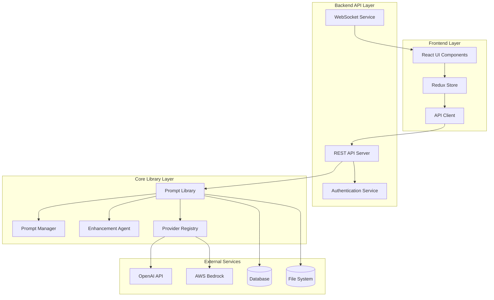
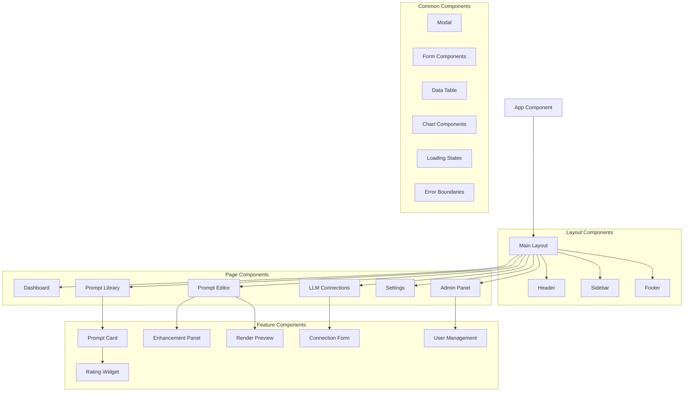

# Design Document

## Overview

The Professional Interface for the Prompt Library system is a modern, responsive web application built using React with TypeScript, providing comprehensive management capabilities for LLM connections, prompt lifecycle management, and user administration. The interface serves as the primary user-facing layer for the existing TypeScript-based prompt library system, offering both technical and non-technical users an intuitive way to manage AI prompts across multiple providers.

The design follows a modular, component-based architecture with clear separation of concerns, leveraging the existing prompt library services through a RESTful API layer. The interface supports real-time updates, offline capabilities, and comprehensive accessibility features.

## Architecture

### High-Level Architecture



### Technology Stack

**Frontend:**
- React 18 with TypeScript
- Redux Toolkit for state management
- React Router for navigation
- Material-UI (MUI) for component library
- React Query for server state management
- Socket.io-client for real-time updates
- React Hook Form for form management
- Recharts for data visualization

**Backend API:**
- Node.js with Express.js
- TypeScript
- Socket.io for WebSocket connections
- JWT for authentication
- bcrypt for password hashing
- Helmet for security headers
- Rate limiting middleware

**Infrastructure:**
- Docker for containerization
- Nginx for reverse proxy
- Redis for session storage and caching
- PostgreSQL for user data (optional)
- File system for prompt storage (existing)

## Components and Interfaces

### Frontend Component Architecture



### Core Interface Definitions

```typescript
// API Client Interface
interface APIClient {
  // Authentication
  login(credentials: LoginCredentials): Promise<AuthResponse>;
  logout(): Promise<void>;
  refreshToken(): Promise<AuthResponse>;
  
  // Prompts
  getPrompts(filters?: PromptFilters): Promise<PromptRecord[]>;
  getPrompt(id: string): Promise<PromptRecord>;
  createPrompt(data: CreatePromptRequest): Promise<PromptRecord>;
  updatePrompt(id: string, data: UpdatePromptRequest): Promise<PromptRecord>;
  deletePrompt(id: string): Promise<void>;
  
  // Enhancement
  enhancePrompt(id: string, options?: EnhancementOptions): Promise<EnhancementResult>;
  
  // Rendering
  renderPrompt(id: string, provider: string, options: RenderOptions): Promise<ProviderPayload>;
  
  // Connections
  getConnections(): Promise<LLMConnection[]>;
  createConnection(data: CreateConnectionRequest): Promise<LLMConnection>;
  updateConnection(id: string, data: UpdateConnectionRequest): Promise<LLMConnection>;
  deleteConnection(id: string): Promise<void>;
  testConnection(id: string): Promise<ConnectionTestResult>;
  
  // Ratings
  ratePrompt(promptId: string, rating: RatingData): Promise<void>;
  getPromptRatings(promptId: string): Promise<Rating[]>;
  
  // System
  getSystemStatus(): Promise<SystemStatus>;
  getSystemStats(): Promise<SystemStats>;
}

// State Management Interfaces
interface AppState {
  auth: AuthState;
  prompts: PromptsState;
  connections: ConnectionsState;
  ui: UIState;
  system: SystemState;
}

interface AuthState {
  user: User | null;
  token: string | null;
  isAuthenticated: boolean;
  isLoading: boolean;
  error: string | null;
}

interface PromptsState {
  items: PromptRecord[];
  currentPrompt: PromptRecord | null;
  filters: PromptFilters;
  isLoading: boolean;
  error: string | null;
  pagination: PaginationState;
}

interface ConnectionsState {
  items: LLMConnection[];
  isLoading: boolean;
  error: string | null;
  testResults: Record<string, ConnectionTestResult>;
}
```

### Backend API Endpoints

```typescript
// Authentication Routes
POST   /api/auth/login
POST   /api/auth/logout
POST   /api/auth/refresh
GET    /api/auth/me

// Prompt Management Routes
GET    /api/prompts
POST   /api/prompts
GET    /api/prompts/:id
PUT    /api/prompts/:id
DELETE /api/prompts/:id
POST   /api/prompts/:id/enhance
POST   /api/prompts/:id/render/:provider
GET    /api/prompts/:id/history
POST   /api/prompts/:id/rate

// Connection Management Routes
GET    /api/connections
POST   /api/connections
GET    /api/connections/:id
PUT    /api/connections/:id
DELETE /api/connections/:id
POST   /api/connections/:id/test

// System Routes
GET    /api/system/status
GET    /api/system/stats
GET    /api/system/health

// User Management Routes (Admin)
GET    /api/admin/users
POST   /api/admin/users
PUT    /api/admin/users/:id
DELETE /api/admin/users/:id

// WebSocket Events
connection
disconnect
prompt:updated
system:status
enhancement:progress
render:complete
```

## Data Models

### Frontend Data Models

```typescript
interface User {
  id: string;
  username: string;
  email: string;
  role: 'admin' | 'user' | 'viewer';
  createdAt: string;
  lastLogin: string;
  preferences: UserPreferences;
}

interface UserPreferences {
  theme: 'light' | 'dark' | 'auto';
  language: string;
  defaultProvider: string;
  notifications: NotificationSettings;
}

interface LLMConnection {
  id: string;
  name: string;
  provider: 'openai' | 'bedrock';
  status: 'active' | 'inactive' | 'error';
  config: OpenAIConfig | BedrockConfig;
  createdAt: string;
  updatedAt: string;
  lastTested: string;
}

interface OpenAIConfig {
  apiKey: string; // encrypted
  organizationId?: string;
  baseUrl?: string;
  models: string[];
  defaultModel: string;
}

interface BedrockConfig {
  accessKeyId: string; // encrypted
  secretAccessKey: string; // encrypted
  region: string;
  models: string[];
  defaultModel: string;
}

interface ConnectionTestResult {
  success: boolean;
  latency?: number;
  error?: string;
  availableModels?: string[];
  testedAt: string;
}

interface EnhancementProgress {
  promptId: string;
  stage: 'analyzing' | 'enhancing' | 'generating_questions' | 'complete';
  progress: number;
  message: string;
}

interface SystemStatus {
  status: 'healthy' | 'degraded' | 'down';
  services: {
    api: ServiceStatus;
    database: ServiceStatus;
    storage: ServiceStatus;
    llm: ServiceStatus;
  };
  uptime: number;
  version: string;
}

interface ServiceStatus {
  status: 'up' | 'down' | 'degraded';
  responseTime?: number;
  error?: string;
}
```

### API Request/Response Models

```typescript
interface CreatePromptRequest {
  metadata: {
    title: string;
    summary: string;
    tags: string[];
  };
  humanPrompt: HumanPrompt;
}

interface UpdatePromptRequest {
  metadata?: Partial<PromptMetadata>;
  humanPrompt?: Partial<HumanPrompt>;
  variables?: Variable[];
}

interface CreateConnectionRequest {
  name: string;
  provider: 'openai' | 'bedrock';
  config: OpenAIConfig | BedrockConfig;
}

interface RatingData {
  score: number; // 1-5
  note?: string;
}

interface PromptFilters {
  search?: string;
  tags?: string[];
  owner?: string;
  status?: PromptStatus[];
  rating?: { min: number; max: number };
  dateRange?: { start: string; end: string };
  sortBy?: 'title' | 'created_at' | 'updated_at' | 'rating';
  sortOrder?: 'asc' | 'desc';
  page?: number;
  limit?: number;
}
```

## Error Handling

### Frontend Error Handling Strategy

```typescript
// Error Boundary Component
class ErrorBoundary extends React.Component {
  // Catches JavaScript errors in component tree
  // Displays fallback UI
  // Logs errors to monitoring service
}

// API Error Handling
interface APIError {
  code: string;
  message: string;
  details?: any;
  timestamp: string;
}

// Error Types
enum ErrorType {
  NETWORK_ERROR = 'NETWORK_ERROR',
  AUTHENTICATION_ERROR = 'AUTHENTICATION_ERROR',
  VALIDATION_ERROR = 'VALIDATION_ERROR',
  PERMISSION_ERROR = 'PERMISSION_ERROR',
  SERVER_ERROR = 'SERVER_ERROR',
  NOT_FOUND_ERROR = 'NOT_FOUND_ERROR'
}

// Error Handling Utilities
class ErrorHandler {
  static handle(error: APIError): void {
    switch (error.code) {
      case ErrorType.AUTHENTICATION_ERROR:
        // Redirect to login
        break;
      case ErrorType.PERMISSION_ERROR:
        // Show permission denied message
        break;
      case ErrorType.VALIDATION_ERROR:
        // Show validation errors in form
        break;
      default:
        // Show generic error message
    }
  }
}
```

### Backend Error Handling

```typescript
// Error Middleware
interface ErrorResponse {
  error: {
    code: string;
    message: string;
    details?: any;
  };
  timestamp: string;
  requestId: string;
}

// Custom Error Classes
class ValidationError extends Error {
  constructor(public field: string, message: string) {
    super(message);
    this.name = 'ValidationError';
  }
}

class AuthenticationError extends Error {
  constructor(message: string = 'Authentication required') {
    super(message);
    this.name = 'AuthenticationError';
  }
}

class PermissionError extends Error {
  constructor(message: string = 'Insufficient permissions') {
    super(message);
    this.name = 'PermissionError';
  }
}
```

## Testing Strategy

### Frontend Testing

```typescript
// Component Testing with React Testing Library
describe('PromptCard Component', () => {
  it('should display prompt information correctly', () => {
    // Test component rendering
  });
  
  it('should handle rating submission', () => {
    // Test user interactions
  });
});

// Integration Testing
describe('Prompt Management Flow', () => {
  it('should create, enhance, and render a prompt', () => {
    // Test complete user workflow
  });
});

// API Client Testing
describe('API Client', () => {
  it('should handle authentication correctly', () => {
    // Test API interactions
  });
});
```

### Backend Testing

```typescript
// API Endpoint Testing
describe('Prompt API', () => {
  it('should create a new prompt', async () => {
    // Test API endpoints
  });
  
  it('should handle authentication', async () => {
    // Test authentication middleware
  });
});

// Integration Testing with Prompt Library
describe('Prompt Library Integration', () => {
  it('should enhance prompts correctly', async () => {
    // Test integration with existing library
  });
});
```

### End-to-End Testing

```typescript
// Cypress E2E Tests
describe('Prompt Management Workflow', () => {
  it('should allow user to create and manage prompts', () => {
    cy.login('user@example.com', 'password');
    cy.visit('/prompts');
    cy.get('[data-testid="create-prompt"]').click();
    // Test complete user workflow
  });
});
```

## Security Considerations

### Authentication & Authorization

```typescript
// JWT Token Structure
interface JWTPayload {
  userId: string;
  username: string;
  role: string;
  permissions: string[];
  iat: number;
  exp: number;
}

// Role-Based Access Control
enum Permission {
  READ_PROMPTS = 'read:prompts',
  WRITE_PROMPTS = 'write:prompts',
  DELETE_PROMPTS = 'delete:prompts',
  MANAGE_CONNECTIONS = 'manage:connections',
  ADMIN_USERS = 'admin:users',
  SYSTEM_CONFIG = 'system:config'
}

// Authorization Middleware
const requirePermission = (permission: Permission) => {
  return (req: Request, res: Response, next: NextFunction) => {
    if (!req.user?.permissions.includes(permission)) {
      return res.status(403).json({ error: 'Insufficient permissions' });
    }
    next();
  };
};
```

### Data Protection

```typescript
// Encryption for Sensitive Data
class EncryptionService {
  static encrypt(data: string): string {
    // AES-256-GCM encryption for API keys
  }
  
  static decrypt(encryptedData: string): string {
    // Decryption for API keys
  }
}

// Input Validation
const validatePromptInput = (data: any): ValidationResult => {
  // Sanitize and validate all user inputs
  // Prevent XSS and injection attacks
};
```

### Security Headers & Middleware

```typescript
// Security Configuration
app.use(helmet({
  contentSecurityPolicy: {
    directives: {
      defaultSrc: ["'self'"],
      scriptSrc: ["'self'", "'unsafe-inline'"],
      styleSrc: ["'self'", "'unsafe-inline'"],
      imgSrc: ["'self'", "data:", "https:"],
    },
  },
  hsts: {
    maxAge: 31536000,
    includeSubDomains: true,
    preload: true
  }
}));

// Rate Limiting
const rateLimiter = rateLimit({
  windowMs: 15 * 60 * 1000, // 15 minutes
  max: 100, // limit each IP to 100 requests per windowMs
  message: 'Too many requests from this IP'
});
```

## Performance Optimization

### Frontend Performance

```typescript
// Code Splitting
const PromptEditor = lazy(() => import('./components/PromptEditor'));
const AdminPanel = lazy(() => import('./components/AdminPanel'));

// Memoization
const PromptCard = memo(({ prompt }: { prompt: PromptRecord }) => {
  // Component implementation
});

// Virtual Scrolling for Large Lists
const VirtualizedPromptList = ({ prompts }: { prompts: PromptRecord[] }) => {
  // Implementation with react-window
};

// Caching Strategy
const queryClient = new QueryClient({
  defaultOptions: {
    queries: {
      staleTime: 5 * 60 * 1000, // 5 minutes
      cacheTime: 10 * 60 * 1000, // 10 minutes
    },
  },
});
```

### Backend Performance

```typescript
// Response Caching
const cache = new NodeCache({ stdTTL: 300 }); // 5 minutes

// Database Query Optimization
const getPromptsWithPagination = async (filters: PromptFilters) => {
  // Implement efficient pagination and filtering
};

// Connection Pooling
const connectionPool = {
  max: 10,
  min: 2,
  acquire: 30000,
  idle: 10000
};
```

## Deployment Architecture

### Docker Configuration

```dockerfile
# Frontend Dockerfile
FROM node:18-alpine
WORKDIR /app
COPY package*.json ./
RUN npm ci --only=production
COPY . .
RUN npm run build
EXPOSE 3000
CMD ["npm", "start"]

# Backend Dockerfile
FROM node:18-alpine
WORKDIR /app
COPY package*.json ./
RUN npm ci --only=production
COPY . .
RUN npm run build
EXPOSE 8000
CMD ["npm", "start"]
```

### Docker Compose

```yaml
version: '3.8'
services:
  frontend:
    build: ./frontend
    ports:
      - "3000:3000"
    environment:
      - REACT_APP_API_URL=http://localhost:8000
    depends_on:
      - backend
  
  backend:
    build: ./backend
    ports:
      - "8000:8000"
    environment:
      - NODE_ENV=production
      - JWT_SECRET=${JWT_SECRET}
      - REDIS_URL=redis://redis:6379
    depends_on:
      - redis
      - postgres
    volumes:
      - ./data:/app/data
  
  redis:
    image: redis:7-alpine
    ports:
      - "6379:6379"
  
  postgres:
    image: postgres:15-alpine
    environment:
      - POSTGRES_DB=promptlib
      - POSTGRES_USER=${DB_USER}
      - POSTGRES_PASSWORD=${DB_PASSWORD}
    volumes:
      - postgres_data:/var/lib/postgresql/data
  
  nginx:
    image: nginx:alpine
    ports:
      - "80:80"
      - "443:443"
    volumes:
      - ./nginx.conf:/etc/nginx/nginx.conf
      - ./ssl:/etc/nginx/ssl
    depends_on:
      - frontend
      - backend

volumes:
  postgres_data:
```

### Environment Configuration

```typescript
// Environment Variables
interface EnvironmentConfig {
  // Server
  PORT: number;
  NODE_ENV: 'development' | 'production' | 'test';
  
  // Database
  DATABASE_URL?: string;
  REDIS_URL: string;
  
  // Authentication
  JWT_SECRET: string;
  JWT_EXPIRES_IN: string;
  
  // Encryption
  ENCRYPTION_KEY: string;
  
  // External Services
  OPENAI_API_KEY?: string;
  AWS_ACCESS_KEY_ID?: string;
  AWS_SECRET_ACCESS_KEY?: string;
  AWS_REGION?: string;
  
  // Storage
  STORAGE_DIR: string;
  
  // Logging
  LOG_LEVEL: 'debug' | 'info' | 'warn' | 'error';
}
```

This design provides a comprehensive foundation for building a professional interface that meets all the requirements while maintaining scalability, security, and maintainability.