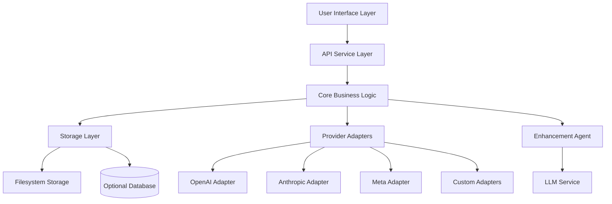
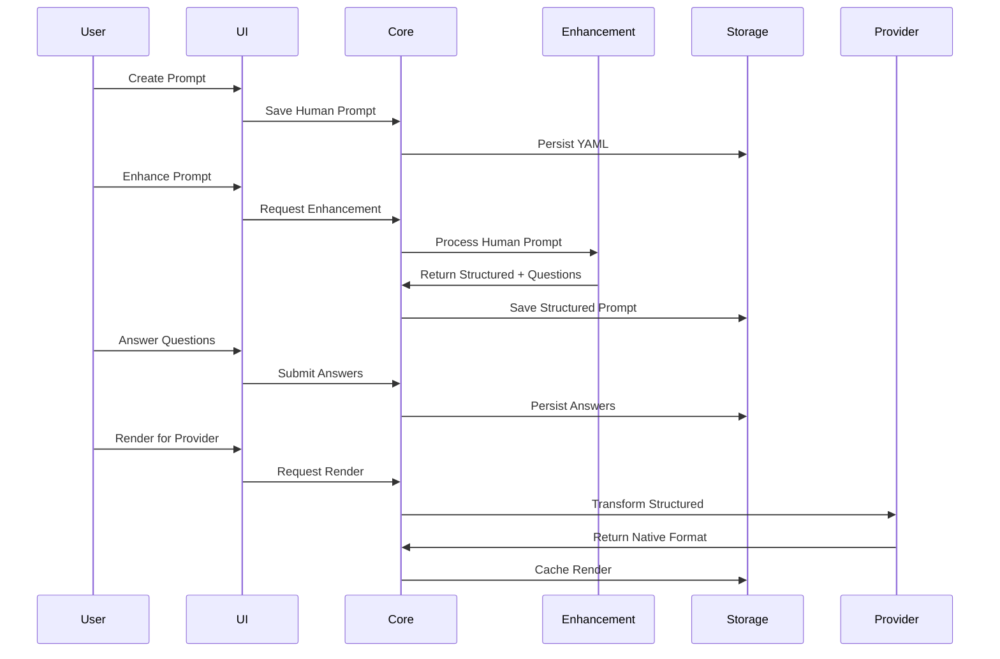

# Design Document

## Overview

The Prompt Library is architected as a spec-driven, provider-agnostic system that separates concerns between prompt storage, enhancement, rendering, and provider adapters. The design follows a layered architecture with a filesystem-first storage approach, optional database indexing, and a plugin-based provider system that enables extensibility to new AI services.

The core philosophy centers on maintaining human-readable prompt definitions while providing automated enhancement and multi-provider compatibility through a structured transformation pipeline.

## Architecture

### High-Level Architecture



### Data Flow Architecture



## Components and Interfaces

### Core Components

#### 1. Prompt Manager
**Responsibility:** Central orchestrator for prompt lifecycle management

```typescript
interface PromptManager {
  createPrompt(humanPrompt: HumanPrompt): Promise<PromptRecord>
  updatePrompt(id: string, updates: Partial<PromptRecord>): Promise<PromptRecord>
  getPrompt(id: string): Promise<PromptRecord>
  listPrompts(filters: PromptFilters): Promise<PromptRecord[]>
  deletePrompt(id: string): Promise<void>
  enhancePrompt(id: string): Promise<EnhancementResult>
  renderPrompt(id: string, provider: string, options: RenderOptions): Promise<ProviderPayload>
}
```

#### 2. Enhancement Agent
**Responsibility:** LLM-powered prompt improvement and structuring

```typescript
interface EnhancementAgent {
  enhance(humanPrompt: HumanPrompt, context?: EnhancementContext): Promise<EnhancementResult>
  generateQuestions(variables: Variable[]): Promise<Question[]>
  validateStructuredPrompt(structured: StructuredPrompt): ValidationResult
}

interface EnhancementResult {
  structuredPrompt: StructuredPrompt
  questions: Question[]
  rationale: string
  confidence: number
}
```

#### 3. Provider Registry
**Responsibility:** Management and discovery of provider adapters

```typescript
interface ProviderRegistry {
  registerAdapter(adapter: ProviderAdapter): void
  getAdapter(providerId: string): ProviderAdapter
  listProviders(): ProviderInfo[]
  supportsModel(model: string): ProviderInfo[]
}
```

#### 4. Variable Manager
**Responsibility:** Question generation and answer collection

```typescript
interface VariableManager {
  generateQuestions(variables: Variable[]): Question[]
  collectAnswers(questions: Question[]): Promise<Answer[]>
  validateAnswers(answers: Answer[], variables: Variable[]): ValidationResult
  substituteVariables(template: string, answers: Answer[]): string
}
```

#### 5. Rating System
**Responsibility:** Prompt evaluation and feedback collection

```typescript
interface RatingSystem {
  ratePrompt(promptId: string, userId: string, rating: Rating): Promise<void>
  getPromptRatings(promptId: string): Promise<Rating[]>
  getAverageRating(promptId: string): Promise<number>
  getTopRatedPrompts(limit: number): Promise<PromptRecord[]>
}
```

### Provider Adapter Interface

```typescript
interface ProviderAdapter {
  readonly id: string
  readonly name: string
  readonly supportedModels: string[]
  
  render(structured: StructuredPrompt, options: RenderOptions): ProviderPayload
  validate(payload: ProviderPayload): ValidationResult
  supports(model: string): boolean
  getDefaultOptions(): RenderOptions
}

interface RenderOptions {
  model: string
  temperature?: number
  topP?: number
  maxTokens?: number
  systemOverride?: string
}
```

## Data Models

### Core Data Structures

#### Prompt Record (Filesystem Storage)
```yaml
# prompts/{slug}.prompt.yaml
version: 1
id: string (uuid-v4)
slug: string (kebab-case)
created_at: string (ISO 8601)
updated_at: string (ISO 8601)
status: "draft" | "active" | "archived"

metadata:
  title: string
  summary: string
  tags: string[]
  owner: string

prompt_human:
  goal: string
  audience: string
  steps: string[]
  output_expectations:
    format: string
    fields: string[]

variables:
  - key: string
    label: string
    type: "string" | "number" | "select" | "multiselect" | "boolean"
    required: boolean
    options?: string[]
    sensitive?: boolean

history:
  versions:
    - number: number
      message: string
      created_at: string
      author: string
  ratings:
    - user: string
      score: number (1-5)
      note: string
      created_at: string

renders:
  - provider: string
    model_hint: string
    version_of_prompt: number
    created_at: string
    content_ref: string
```

#### Structured Prompt (Internal Format)
```yaml
# prompts/{slug}.structured.yaml
schema_version: 1
system: string[]
capabilities: string[]
user_template: string
rules:
  - name: string
    description: string
variables: string[]
```

#### Database Schema (Optional Indexing)
```sql
-- Prompts table for fast querying
CREATE TABLE prompts (
  id UUID PRIMARY KEY,
  slug VARCHAR(255) UNIQUE NOT NULL,
  title VARCHAR(500) NOT NULL,
  summary TEXT,
  status VARCHAR(20) NOT NULL,
  owner VARCHAR(255),
  created_at TIMESTAMP NOT NULL,
  updated_at TIMESTAMP NOT NULL,
  avg_rating DECIMAL(3,2),
  rating_count INTEGER DEFAULT 0
);

-- Tags for filtering
CREATE TABLE prompt_tags (
  prompt_id UUID REFERENCES prompts(id),
  tag VARCHAR(100) NOT NULL,
  PRIMARY KEY (prompt_id, tag)
);

-- Ratings aggregation
CREATE TABLE ratings (
  id UUID PRIMARY KEY,
  prompt_id UUID REFERENCES prompts(id),
  user_id VARCHAR(255) NOT NULL,
  score INTEGER CHECK (score >= 1 AND score <= 5),
  note TEXT,
  created_at TIMESTAMP NOT NULL,
  UNIQUE(prompt_id, user_id)
);

-- Questions and answers
CREATE TABLE questions (
  id UUID PRIMARY KEY,
  prompt_id UUID REFERENCES prompts(id),
  variable_key VARCHAR(100) NOT NULL,
  text TEXT NOT NULL,
  type VARCHAR(20) NOT NULL,
  required BOOLEAN NOT NULL,
  options JSONB
);

CREATE TABLE answers (
  id UUID PRIMARY KEY,
  question_id UUID REFERENCES questions(id),
  user_id VARCHAR(255) NOT NULL,
  value JSONB NOT NULL,
  created_at TIMESTAMP NOT NULL
);
```

## Error Handling

### Error Categories and Strategies

#### 1. Validation Errors
- **Prompt Structure Validation:** Invalid YAML format, missing required fields
- **Variable Validation:** Type mismatches, missing required variables
- **Provider Validation:** Unsupported models, invalid render options
- **Strategy:** Return detailed validation messages with field-level errors

#### 2. Enhancement Errors
- **LLM Service Failures:** API timeouts, rate limits, service unavailability
- **Enhancement Quality:** Low confidence scores, incomplete transformations
- **Strategy:** Graceful degradation with fallback to manual editing, retry mechanisms

#### 3. Storage Errors
- **Filesystem Errors:** Permission issues, disk space, file corruption
- **Database Errors:** Connection failures, constraint violations
- **Strategy:** Atomic operations, backup mechanisms, consistency checks

#### 4. Provider Adapter Errors
- **Render Failures:** Template errors, variable substitution failures
- **Model Compatibility:** Unsupported model requests, deprecated APIs
- **Strategy:** Provider-specific error handling, fallback to compatible models

### Error Response Format
```typescript
interface ErrorResponse {
  code: string
  message: string
  details?: Record<string, any>
  suggestions?: string[]
  retryable: boolean
}
```

## Testing Strategy

### Unit Testing
- **Component Isolation:** Mock dependencies for each core component
- **Provider Adapters:** Test render output against known schemas
- **Variable Substitution:** Comprehensive template rendering tests
- **Validation Logic:** Edge cases for all validation rules

### Integration Testing
- **Enhancement Pipeline:** End-to-end prompt transformation
- **Storage Operations:** Filesystem and database consistency
- **Provider Integration:** Real API calls with test prompts
- **Question/Answer Flow:** Complete variable collection cycle

### End-to-End Testing
- **User Workflows:** Complete prompt lifecycle scenarios
- **Multi-Provider Rendering:** Same prompt across all providers
- **Version Management:** Create, edit, enhance, version scenarios
- **Rating and Evaluation:** Rating aggregation and display

### Performance Testing
- **Large Prompt Libraries:** Scalability with thousands of prompts
- **Concurrent Operations:** Multiple users enhancing/rendering simultaneously
- **Provider Response Times:** Timeout handling and retry logic
- **Database Query Performance:** Indexing effectiveness for search/filter operations

### Test Data Strategy
```yaml
# test-fixtures/sample-prompts/
basic-prompt.yaml:
  goal: "Simple test prompt"
  variables: []

complex-prompt.yaml:
  goal: "Multi-variable prompt with all types"
  variables:
    - {key: "text_var", type: "string", required: true}
    - {key: "num_var", type: "number", required: false}
    - {key: "select_var", type: "select", options: ["a", "b", "c"]}

enhanced-prompt.yaml:
  # Pre-enhanced structured format for testing renders
```

### Continuous Integration
- **Automated Test Runs:** All test suites on every commit
- **Provider Compatibility:** Regular tests against live provider APIs
- **Schema Validation:** Ensure exported formats match provider specifications
- **Performance Benchmarks:** Track response times and resource usage