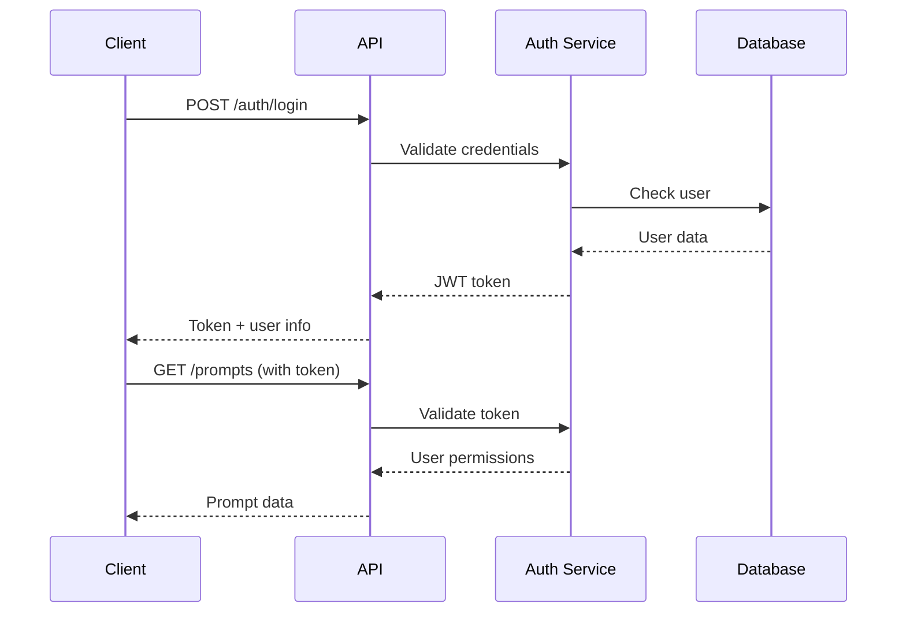

# Developer Documentation

This documentation is for developers who want to extend, customize, or integrate with the Prompt Library Professional Interface.

## Table of Contents

1. [Development Setup](development-setup.md)
2. [Architecture Overview](architecture.md)
3. [API Integration](api-integration.md)
4. [Frontend Customization](frontend-customization.md)
5. [Backend Extensions](backend-extensions.md)
6. [Plugin Development](plugin-development.md)
7. [Testing Guidelines](testing.md)
8. [Contributing Guidelines](contributing.md)
9. [Code Style Guide](code-style.md)
10. [Deployment Automation](deployment.md)

## Quick Start for Developers

### Prerequisites

- **Node.js** 18+ with npm
- **Docker** and Docker Compose
- **Git** for version control
- **Code Editor** (VS Code recommended)
- **PostgreSQL** and **Redis** (or use Docker)

### Development Environment Setup

```bash
# Clone the repository
git clone <repository-url>
cd prompt-library-interface

# Install dependencies
npm install

# Set up environment
cp .env.example .env.development
# Edit .env.development with development settings

# Start development services
docker-compose -f docker-compose.dev.yml up -d

# Start frontend development server
cd frontend
npm run dev

# Start backend development server (in another terminal)
cd backend
npm run dev
```

### Project Structure

```
prompt-library-interface/
├── frontend/                 # React frontend application
│   ├── src/
│   │   ├── components/      # Reusable UI components
│   │   ├── pages/          # Page components
│   │   ├── hooks/          # Custom React hooks
│   │   ├── services/       # API client and services
│   │   ├── store/          # Redux store and slices
│   │   ├── types/          # TypeScript type definitions
│   │   └── utils/          # Utility functions
│   ├── public/             # Static assets
│   └── package.json
├── backend/                 # Node.js backend API
│   ├── src/
│   │   ├── controllers/    # API route handlers
│   │   ├── services/       # Business logic services
│   │   ├── middleware/     # Express middleware
│   │   ├── types/          # TypeScript interfaces
│   │   └── utils/          # Utility functions
│   └── package.json
├── shared/                  # Shared types and utilities
├── docs/                   # Documentation
├── docker/                 # Docker configurations
├── monitoring/             # Monitoring configurations
└── scripts/               # Deployment and utility scripts
```

## Core Technologies

### Frontend Stack

- **React 18** - UI framework with hooks and concurrent features
- **TypeScript** - Type-safe JavaScript development
- **Redux Toolkit** - State management with RTK Query
- **Material-UI (MUI)** - Component library and design system
- **React Router** - Client-side routing
- **React Hook Form** - Form handling and validation
- **Socket.io Client** - Real-time communication
- **Vite** - Fast build tool and development server

### Backend Stack

- **Node.js** - JavaScript runtime
- **Express.js** - Web application framework
- **TypeScript** - Type-safe server development
- **Socket.io** - WebSocket server for real-time features
- **JWT** - Authentication and authorization
- **bcrypt** - Password hashing
- **Helmet** - Security middleware
- **Winston** - Logging framework

### Database and Storage

- **PostgreSQL** - Primary database for user data
- **Redis** - Caching and session storage
- **File System** - Prompt storage (existing library integration)

### Development Tools

- **ESLint** - Code linting and style enforcement
- **Prettier** - Code formatting
- **Vitest** - Unit and integration testing
- **Cypress** - End-to-end testing
- **Docker** - Containerization and development environment

## API Architecture

### RESTful Design Principles

The API follows REST conventions with:
- **Resource-based URLs** (`/api/prompts`, `/api/connections`)
- **HTTP methods** for operations (GET, POST, PUT, DELETE)
- **Status codes** for response indication
- **JSON** for data exchange
- **Pagination** for large datasets

### Authentication Flow



### Real-time Features

WebSocket connections provide real-time updates for:
- **System status** changes
- **Prompt enhancement** progress
- **Collaborative editing** indicators
- **Notification** delivery

## Extension Points

### 1. Custom LLM Providers

Add support for new AI providers by implementing the provider interface:

```typescript
interface LLMProvider {
  name: string;
  validateConfig(config: any): boolean;
  testConnection(config: any): Promise<ConnectionTestResult>;
  renderPrompt(prompt: PromptRecord, config: any): Promise<ProviderPayload>;
  enhancePrompt(prompt: PromptRecord, config: any): Promise<EnhancementResult>;
}
```

### 2. Custom Enhancement Workflows

Extend the enhancement system with custom workflows:

```typescript
interface EnhancementWorkflow {
  name: string;
  description: string;
  execute(prompt: PromptRecord, options: any): Promise<EnhancementResult>;
  generateQuestions(prompt: PromptRecord): Promise<Question[]>;
}
```

### 3. Export Format Plugins

Add new export formats by implementing the exporter interface:

```typescript
interface ExportFormat {
  name: string;
  extension: string;
  mimeType: string;
  export(prompts: PromptRecord[], options: any): Promise<Buffer>;
}
```

### 4. Custom UI Components

Extend the frontend with custom components:

```typescript
// Register custom components
import { ComponentRegistry } from '@/utils/component-registry';

ComponentRegistry.register('custom-prompt-card', CustomPromptCard);
ComponentRegistry.register('custom-filter', CustomFilter);
```

## Integration Patterns

### 1. API Client Integration

```typescript
import { APIClient } from '@prompt-library/client';

const client = new APIClient({
  baseURL: 'https://your-domain.com/api',
  apiKey: 'your-api-key'
});

// Use the client
const prompts = await client.prompts.list({
  tags: ['marketing'],
  limit: 10
});
```

### 2. Webhook Integration

```typescript
// Set up webhooks for external systems
app.post('/webhooks/prompt-updated', (req, res) => {
  const { promptId, action, user } = req.body;
  
  // Handle prompt update in external system
  await externalSystem.updatePrompt(promptId, action);
  
  res.status(200).json({ received: true });
});
```

### 3. SSO Integration

```typescript
// Custom authentication provider
class CustomAuthProvider implements AuthProvider {
  async authenticate(token: string): Promise<User> {
    // Validate token with external system
    const userInfo = await externalAuth.validateToken(token);
    return this.mapToUser(userInfo);
  }
}
```

## Customization Examples

### 1. Custom Theme

```typescript
// Create custom theme
import { createTheme } from '@mui/material/styles';

const customTheme = createTheme({
  palette: {
    primary: {
      main: '#your-brand-color',
    },
    secondary: {
      main: '#your-accent-color',
    },
  },
  typography: {
    fontFamily: 'Your-Custom-Font',
  },
});

// Apply theme in App.tsx
<ThemeProvider theme={customTheme}>
  <App />
</ThemeProvider>
```

### 2. Custom Prompt Fields

```typescript
// Extend prompt metadata
interface CustomPromptMetadata extends PromptMetadata {
  industry: string;
  complexity: 'beginner' | 'intermediate' | 'advanced';
  estimatedTime: number;
}

// Custom prompt form component
const CustomPromptForm: React.FC = () => {
  // Implementation with additional fields
};
```

### 3. Custom Dashboard Widgets

```typescript
// Create custom dashboard widget
const CustomMetricsWidget: React.FC = () => {
  const metrics = useCustomMetrics();
  
  return (
    <Card>
      <CardContent>
        <Typography variant="h6">Custom Metrics</Typography>
        {/* Custom metrics display */}
      </CardContent>
    </Card>
  );
};

// Register widget
DashboardRegistry.register('custom-metrics', CustomMetricsWidget);
```

## Performance Considerations

### Frontend Optimization

- **Code splitting** with React.lazy()
- **Memoization** with React.memo() and useMemo()
- **Virtual scrolling** for large lists
- **Image optimization** and lazy loading
- **Bundle analysis** and optimization

### Backend Optimization

- **Database indexing** for common queries
- **Connection pooling** for database connections
- **Caching strategies** with Redis
- **Response compression** with gzip
- **Rate limiting** to prevent abuse

### Monitoring and Profiling

- **Performance monitoring** with custom metrics
- **Error tracking** with structured logging
- **Database query analysis** and optimization
- **Memory usage** monitoring and optimization
- **Load testing** for scalability validation

## Security Guidelines

### Input Validation

```typescript
// Use validation schemas
import Joi from 'joi';

const promptSchema = Joi.object({
  title: Joi.string().min(1).max(200).required(),
  summary: Joi.string().max(500),
  tags: Joi.array().items(Joi.string().max(50)),
});

// Validate input
const { error, value } = promptSchema.validate(req.body);
if (error) {
  return res.status(400).json({ error: error.details });
}
```

### Authentication Middleware

```typescript
// Secure route middleware
const requireAuth = (permissions: string[] = []) => {
  return async (req: Request, res: Response, next: NextFunction) => {
    try {
      const token = extractToken(req);
      const user = await validateToken(token);
      
      if (permissions.length > 0) {
        const hasPermission = permissions.some(p => user.permissions.includes(p));
        if (!hasPermission) {
          return res.status(403).json({ error: 'Insufficient permissions' });
        }
      }
      
      req.user = user;
      next();
    } catch (error) {
      res.status(401).json({ error: 'Authentication required' });
    }
  };
};
```

### Data Sanitization

```typescript
// Sanitize user input
import DOMPurify from 'dompurify';

const sanitizeInput = (input: string): string => {
  return DOMPurify.sanitize(input, {
    ALLOWED_TAGS: ['b', 'i', 'em', 'strong', 'p', 'br'],
    ALLOWED_ATTR: []
  });
};
```

## Testing Strategies

### Unit Testing

```typescript
// Component testing with React Testing Library
import { render, screen, fireEvent } from '@testing-library/react';
import { PromptCard } from './PromptCard';

describe('PromptCard', () => {
  it('displays prompt information correctly', () => {
    const mockPrompt = {
      id: '1',
      metadata: { title: 'Test Prompt', summary: 'Test summary' },
      // ... other properties
    };
    
    render(<PromptCard prompt={mockPrompt} />);
    
    expect(screen.getByText('Test Prompt')).toBeInTheDocument();
    expect(screen.getByText('Test summary')).toBeInTheDocument();
  });
});
```

### Integration Testing

```typescript
// API integration testing
describe('Prompt API', () => {
  it('creates a new prompt', async () => {
    const response = await request(app)
      .post('/api/prompts')
      .set('Authorization', `Bearer ${authToken}`)
      .send({
        metadata: { title: 'Test Prompt', summary: 'Test' },
        humanPrompt: { goal: 'Test goal' }
      });
    
    expect(response.status).toBe(201);
    expect(response.body.metadata.title).toBe('Test Prompt');
  });
});
```

### End-to-End Testing

```typescript
// Cypress E2E testing
describe('Prompt Management', () => {
  it('allows user to create and edit prompts', () => {
    cy.login('user@example.com', 'password');
    cy.visit('/prompts');
    
    cy.get('[data-testid="create-prompt"]').click();
    cy.get('[data-testid="prompt-title"]').type('New Prompt');
    cy.get('[data-testid="save-prompt"]').click();
    
    cy.contains('New Prompt').should('be.visible');
  });
});
```

## Deployment and CI/CD

### GitHub Actions Workflow

```yaml
name: CI/CD Pipeline

on:
  push:
    branches: [main, develop]
  pull_request:
    branches: [main]

jobs:
  test:
    runs-on: ubuntu-latest
    steps:
      - uses: actions/checkout@v3
      - uses: actions/setup-node@v3
        with:
          node-version: '18'
      
      - name: Install dependencies
        run: npm ci
      
      - name: Run tests
        run: npm test
      
      - name: Run E2E tests
        run: npm run test:e2e

  build:
    needs: test
    runs-on: ubuntu-latest
    steps:
      - uses: actions/checkout@v3
      
      - name: Build Docker images
        run: docker-compose build
      
      - name: Push to registry
        run: |
          docker tag app:latest registry.com/app:${{ github.sha }}
          docker push registry.com/app:${{ github.sha }}

  deploy:
    needs: build
    runs-on: ubuntu-latest
    if: github.ref == 'refs/heads/main'
    steps:
      - name: Deploy to production
        run: |
          # Deployment commands
```

## Contributing Guidelines

### Code Standards

- **TypeScript** for all new code
- **ESLint** and **Prettier** for code formatting
- **Conventional Commits** for commit messages
- **Unit tests** for all new features
- **Documentation** for public APIs

### Pull Request Process

1. **Fork** the repository
2. **Create feature branch** from develop
3. **Write tests** for new functionality
4. **Update documentation** as needed
5. **Submit pull request** with clear description
6. **Address review feedback**
7. **Merge** after approval

### Release Process

1. **Version bump** following semantic versioning
2. **Update changelog** with new features and fixes
3. **Create release tag** and GitHub release
4. **Deploy to staging** for final testing
5. **Deploy to production** after validation

---

*This developer documentation is continuously updated. For the latest information, check the repository and join our developer community.*