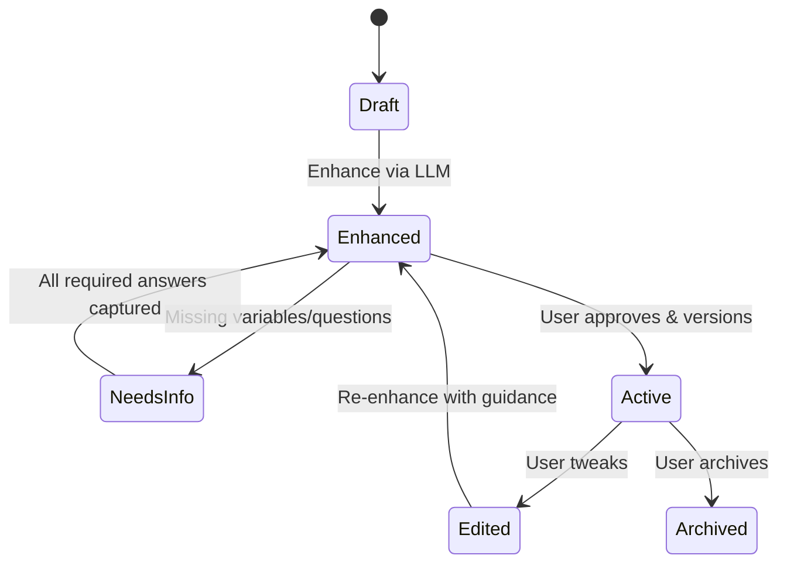

# Prompt Library – Universal Spec v1

A spec-driven design for a portable prompt library that works across model providers (Anthropic/Claude, OpenAI, Meta, etc.), supports enhancement via LLMs, ratings, export/download in provider-native formats, and iterative editing with missing-info capture.

---

## 1) Core Concepts & Requirements

**Goals**
- Browse a library of prompts written in clear, human-friendly English.
- Convert any prompt into a provider-specific format (Claude/OpenAI/Meta…and extensible).
- Enhance prompts with an LLM (fill in best-practice structure, add missing details, optimize instructions).
- Ask the user for any missing information needed to make the prompt executable and save answers.
- Version, edit, and evaluate prompts (ratings 1–5, notes, outcomes).
- Download/export prompts in the selected provider format.

**Non-Goals (v1)**
- No server-side code execution of tools beyond LLM calls.
- No multi-agent orchestration beyond the enhancement & question-asking flows.

**Design Tenets**
- **Spec-first**: All behavior derived from schemas; UI and services read specs, not vice versa.
- **Provider-agnostic core** with thin adapters.
- **Reproducibility** via immutable versions + audit trail.
- **Human-readable**: YAML/Markdown for prompts; JSON for APIs.

---

## 2) Information Architecture

### 2.1 Prompt Record (Provider-Agnostic)
```yaml
# file: prompts/<slug>.prompt.yaml
version: 1
id: "uuid-v4"
slug: "product-idea-brainstorm"
created_at: "2025-09-21T10:00:00Z"
updated_at: "2025-09-21T10:00:00Z"
status: draft # draft|active|archived

metadata:
  title: "Product Idea Brainstorm"
  summary: "Generate creative product ideas for a target audience and constraints."
  tags: ["brainstorm", "ideation", "product"]
  owner: "user@example.com"

# Written for humans; canonical content
prompt_human:
  goal: "Brainstorm at least 15 distinct product ideas for the specified audience and constraints."
  audience: "Startup founders"
  steps:
    - "Clarify constraints (industry, budget, timeframe)."
    - "List varied idea categories (hardware, software, services)."
    - "Score ideas on novelty and feasibility."
  output_expectations:
    format: "markdown-table"
    fields: ["idea", "category", "why_now", "novelty_1_5", "feasibility_1_5"]

# Key-Value placeholders gathered via questionnaire
variables:
  - key: "industry"
    label: "Industry"
    type: string
    required: true
  - key: "budget"
    label: "Approximate budget (USD)"
    type: number
    required: false
  - key: "timeframe"
    label: "Timeframe (months)"
    type: number
    required: true
  - key: "constraints"
    label: "Constraints or exclusions"
    type: string
    required: false

# Revision history and evaluation
history:
  versions:
    - number: 1
      message: "Initial draft"
      created_at: "2025-09-21T10:00:00Z"
      author: "user@example.com"
  ratings:
    # user_id → 1..5
    - user: "user@example.com"
      score: 4
      note: "Great variety, needed better feasibility guidance."
      created_at: "2025-09-21T10:10:00Z"

# Provider-specific cached renders (regenerated on demand)
renders:
  - provider: openai
    model_hint: "gpt-4o"
    version_of_prompt: 1
    created_at: "2025-09-21T10:05:00Z"
    content_ref: "renders/openai/product-idea-brainstorm_v1.json"
  - provider: anthropic
    model_hint: "claude-3.5-sonnet"
    version_of_prompt: 1
    created_at: "2025-09-21T10:06:00Z"
    content_ref: "renders/anthropic/product-idea-brainstorm_v1.json"
```

### 2.2 Enhancement Spec (LLM-assisted)
```yaml
# file: specs/enhancement.agent.yaml
id: "enhancement-agent"
role: "Enhances human-written prompts into provider-agnostic best-practice scaffolds."
input_contract:
  - prompt_human (required)
  - variables[] (optional)
  - style_guidelines (optional)
output_contract:
  - prompt_structured # see below
  - questions[]       # missing-information questions
  - rationale         # why changes were made
policy:
  - "Preserve original intent; do not alter goal unless unclear."
  - "Prefer explicit outputs and acceptance criteria."
  - "Suggest evaluation harness seeds when possible."
```

### 2.3 Structured Prompt (Canonical Internal Form)
```yaml
# file: prompts/<slug>.structured.yaml
schema_version: 1
system:
  - "You are an expert facilitator of ideation."
capabilities:
  - reasoning: "chain-of-thought-suppressed; use internal planning only"
  - formatting: "markdown-table"
user_template: |
  Goal: {{goal}}
  Audience: {{audience}}
  Industry: {{industry}}
  Constraints: {{constraints}}
  Output fields: {{fields|join(", ")}}

rules:
  - name: coverage
    description: "Provide >= 15 ideas across >= 4 categories."
  - name: scoring
    description: "Score novelty and feasibility from 1..5 and justify briefly."

variables: ["industry", "budget", "timeframe", "constraints"]
```

---

## 3) Provider Adapters & Render Templates

Adapters map the **Structured Prompt** → provider-native message objects/config.

### 3.1 OpenAI Adapter (messages + tools)
```json
{
  "provider": "openai",
  "render": {
    "model": "gpt-4o",
    "temperature": 0.7,
    "messages": [
      {"role":"system","content": "You are an expert facilitator of ideation."},
      {"role":"user","content": "Goal: {{goal}}\nAudience: {{audience}}\nIndustry: {{industry}}\nConstraints: {{constraints}}\nOutput fields: {{fields}}"}
    ]
  }
}
```

### 3.2 Anthropic/Claude Adapter
```json
{
  "provider": "anthropic",
  "render": {
    "model": "claude-3.5-sonnet",
    "temperature": 0.7,
    "system": "You are an expert facilitator of ideation.",
    "messages": [
      {"role":"user","content": "Goal: {{goal}}\nAudience: {{audience}}\nIndustry: {{industry}}\nConstraints: {{constraints}}\nOutput fields: {{fields}}"}
    ]
  }
}
```

### 3.3 Meta (Llama) Adapter (system+prompt)
```json
{
  "provider": "meta",
  "render": {
    "model": "llama-3.1-70b-instruct",
    "temperature": 0.7,
    "messages": [
      {"role":"system","content": "You are an expert facilitator of ideation."},
      {"role":"user","content": "Goal: {{goal}}\nAudience: {{audience}}\nIndustry: {{industry}}\nConstraints: {{constraints}}\nOutput fields: {{fields}}"}
    ]
  }
}
```

**Note:** Additional providers just add a render template. All templates use the same variable names.

---

## 4) Questionnaire & Missing-Info Capture

### 4.1 Question Model
```yaml
# questions generated by the enhancement agent when variables are missing
question:
  id: "q-timeframe"
  prompt_id: "product-idea-brainstorm"
  text: "What timeframe (in months) are you targeting for the first launch?"
  type: number # string|number|select|multiselect|boolean
  required: true
  options: null
```

### 4.2 Answer Persistence
```yaml
answer:
  question_id: "q-timeframe"
  value: 6
  captured_at: "2025-09-21T10:12:00Z"
  captured_by: "user@example.com"
```

During compose/render, variable substitution occurs with captured answers; unresolved required variables block export with a helpful message.

---

## 5) Ratings & Evaluation

### 5.1 Simple Star Ratings
```yaml
rating:
  prompt_id: "product-idea-brainstorm"
  user: "user@example.com"
  score: 5 # 1..5
  note: "High novelty, actionable."
  created_at: "2025-09-21T11:00:00Z"
```

### 5.2 Run-Log & Outcome Notes (optional instrumentation)
```yaml
run_log:
  prompt_id: "product-idea-brainstorm"
  provider: "openai"
  model: "gpt-4o"
  timestamp: "2025-09-21T11:05:00Z"
  input_hash: "sha256:..."
  outputs_meta:
    tokens_input: 1234
    tokens_output: 890
  outcome_note: "User selected 5 ideas to pursue."
```

Aggregate ratings by prompt/version to surface the best prompts.

---

## 6) Export/Download Formats

### 6.1 OpenAI JSON (chat.completions shape)
```json
{
  "model": "gpt-4o",
  "temperature": 0.7,
  "messages": [
    {"role":"system","content":"You are an expert facilitator of ideation."},
    {"role":"user","content":"Goal: {{goal}}\nAudience: {{audience}}\nIndustry: {{industry}}\nConstraints: {{constraints}}\nOutput fields: {{fields}}"}
  ]
}
```

### 6.2 Anthropic JSON
```json
{
  "model": "claude-3.5-sonnet",
  "temperature": 0.7,
  "system": "You are an expert facilitator of ideation.",
  "messages": [
    {"role":"user","content":"Goal: {{goal}}\nAudience: {{audience}}\nIndustry: {{industry}}\nConstraints: {{constraints}}\nOutput fields: {{fields}}"}
  ]
}
```

### 6.3 Meta (Llama) JSON (OpenAI-style messages or prompt string depending on SDK)
```json
{
  "model": "llama-3.1-70b-instruct",
  "temperature": 0.7,
  "messages": [
    {"role":"system","content":"You are an expert facilitator of ideation."},
    {"role":"user","content":"Goal: {{goal}}\nAudience: {{audience}}\nIndustry: {{industry}}\nConstraints: {{constraints}}\nOutput fields: {{fields}}"}
  ]
}
```

Exports are produced after variable substitution. Download naming: `<slug>_<provider>_v<version>.json`.

---

## 7) Enhancement & Update Flow (State Machine)



**Enhance Operation (pseudo):**
```json
{
  "op": "enhance",
  "input": { "prompt_human": { "goal":"...", "steps":[...] }, "variables": [...] },
  "agent": "enhancement-agent",
  "output": {
    "prompt_structured": { ... },
    "questions": [ {"id":"q1", "text":"...", "type":"string"} ],
    "rationale": "Added scoring rubric to improve comparability."
  }
}
```

---

## 8) APIs (for app/CLI)

### 8.1 REST-ish Endpoints
```
GET  /prompts?status=active|draft&tag=...
POST /prompts          # create from human text
GET  /prompts/{id}
PUT  /prompts/{id}     # update metadata/prompt_human/variables
POST /prompts/{id}/enhance
POST /prompts/{id}/questions/answer
POST /prompts/{id}/render/{provider}
GET  /prompts/{id}/download/{provider}
POST /prompts/{id}/rate   # body: {score, note}
```

### 8.2 Types (OpenAPI Snippets)
```yaml
components:
  schemas:
    PromptHuman:
      type: object
      properties:
        goal: {type: string}
        audience: {type: string}
        steps: {type: array, items: {type: string}}
        output_expectations:
          type: object
          properties:
            format: {type: string}
            fields: {type: array, items: {type: string}}
    Rating:
      type: object
      properties:
        user: {type: string}
        score: {type: integer, minimum: 1, maximum: 5}
        note: {type: string}
```

---

## 9) Storage Layout (Filesystem First, DB Optional)
```
./prompts/
  product-idea-brainstorm.prompt.yaml
  product-idea-brainstorm.structured.yaml
./renders/
  openai/product-idea-brainstorm_v1.json
  anthropic/product-idea-brainstorm_v1.json
./specs/
  enhancement.agent.yaml
```

Optional DB tables for indexing and aggregation: `prompts`, `versions`, `ratings`, `runs`, `questions`, `answers`.

---

## 10) UI/UX Requirements

- **Library View**: grid/list of prompts with title, tags, avg rating, last-updated, quick actions: Enhance, Render, Download.
- **Prompt Detail**:
  - Tabs: Human, Structured, Variables, Ratings, History.
  - "Enhance with LLM" button; shows diff of changes and rationale.
  - "Missing Info" panel auto-asks questions; inline form saves answers.
  - "Render" dropdown per provider; preview + download.
  - Rating widget (1–5 stars) and notes.
- **Edit Flow**: markdown editor for Human, YAML editor (read-only by default) for Structured with regenerate.

---

## 11) Provider Adapter Contract

```ts
export interface ProviderAdapter {
  id: string; // 'openai' | 'anthropic' | 'meta' | ...
  render(structuredPrompt: StructuredPrompt, options: RenderOptions): ProviderPayload;
  supports(model: string): boolean;
}
```

`RenderOptions` includes `model`, `temperature`, `top_p`, `system_override?`.

---

## 12) Security & Privacy
- Store API keys per provider in encrypted keychain/secret manager.
- Strip PII from saved prompts by default (or mark fields as sensitive: `variables[].sensitive: true`).
- Log hashes of inputs, not raw text, if compliance required.

---

## 13) Testing & Acceptance Criteria

**Unit**
- Render templates replace all required variables; error if missing.
- Ratings persist across versions and aggregate correctly.

**Integration**
- Enhancement agent produces Structured Prompt + ≥1 question when required variables are missing.
- Downloads match provider schemas (JSON schema validation).

**E2E**
- Create → Enhance → Answer questions → Render (OpenAI) → Download → Rate → Edit → Re-enhance → New version.

---

## 14) Roadmap (Post-v1)
- Batch evaluations (A/B testing across models with rubric prompts).
- Prompt packs, sharing/permissions.
- Embedding search over library.
- Diff-based version comparisons and rollback.
- CLI: `pl add|enhance|render|download`.

---

## 15) Example Minimal Prompt (Human → Structured → Render)

**Human (input)**
```yaml
goal: "Summarize a technical RFC for executives"
audience: "C-suite"
steps: ["Identify risks", "Call out dependencies", "Give decision options"]
output_expectations:
  format: "bulleted"
  fields: ["executive_summary", "risks", "options", "recommendation"]
```

**Structured (produced)**
```yaml
system: ["You write concise executive briefs."]
user_template: |
  Please summarize the RFC with sections:
  - Executive Summary
  - Risks
  - Options
  - Recommendation
  Context: {{context}}
variables: ["context"]
```

**OpenAI Render**
```json
{"model":"gpt-4o","messages":[{"role":"system","content":"You write concise executive briefs."},{"role":"user","content":"Please summarize the RFC with sections:\n- Executive Summary\n- Risks\n- Options\n- Recommendation\nContext: {{context}}"}],"temperature":0.3}
```

---

**This document is the single source of truth for building the program.**

